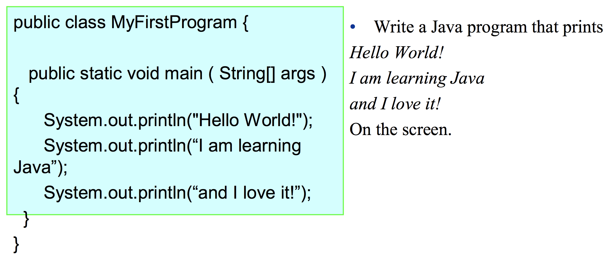
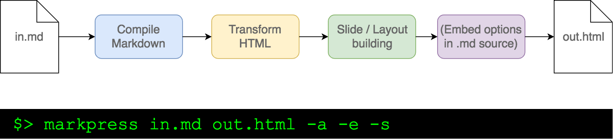
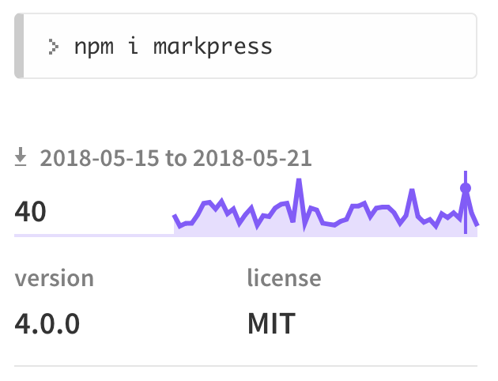
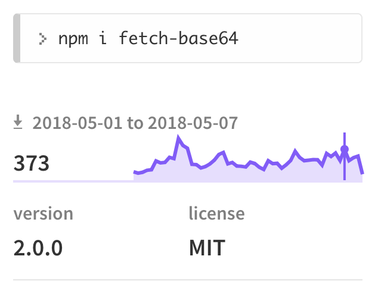

<!--markpress-opt

{
	"layout": "random",
	"theme": "light",
	"autoSplit": false,
	"sanitize": false,
	"embed": true,
	"edit": true,
	"title": "tesla"
}

markpress-opt-->

<style>
  h1 { margin-bottom: 2em; }
</style>

# Joan Gamell

&nbsp;
&nbsp;
&nbsp;

:zap: Currently at LinkedIn

:zap: I liked `JS` before it was _cool_

:zap: You can call me "**John**"

----------

# Markpress, my presentation Open Source project to generate presentations

----------

# Why?

- I don't like PowerPoint presentations :sweat_smile:

&nbsp;
&nbsp;

#### Also, I wondered...

----------

# Why can't we have "source code" for our slides?
  - Version control friendly
  - Easy to diff
  - Low-tech, easy to collaborate with team mates

----------

# Why can't I edit my presentations on a text editor?
  - Works everywhere, no need for special software
  - Potentially use `HTML` / `CSS` to enhance your presentation

----------

# Does code need to look so horrible in presentations?



----------

# :bulb:

# Let's build my own!

----------

# Requirements

- Portable: compile & run on any platform
- Self-contained presentations (no need for internet connection)
- Easy to get up and running, but at the same time...
- Customizable
- Encourage "short" slides by default
- Support emojis! :boom:
- Nice code formatting by default:

```js
function sayHello(name) => {
  console.log(`Hello ${name}`);
}
```


----------

# Design considerations

- Source format
- Output format
- Language
- Open source it ?

----------

# Source format


## Markdown

- Simple, universal syntax
- Ubiquotous in tech environments: `README.md`, etc.
- Many choices for Mardown parsing packages

----------

# Output format

- `HTML`
- Embedded scripts, styles and assets (images, etc.)
- Render-able in all platforms

----------

# Language

- `JS`
- My favorite language
- Runnable in all platforms through `node`
- Access to a millions of `npm` packages

----------

# Open Source?

**Yes**, it will force myself to...

- Write better code
- Write ~~better~~ tests

----------

# How does it work?

<div style="text-align:center">
    
</div>


----------

# Challenges

- Designing a CLI is not as easy as it seems
  - Define "common-sense" defaults / behaviors
  - CLI Arguments vs Saved settings on source file
- Relative paths - to what?
- Error (vs Warn)
- Fetching local/remote images & base64-embedding them in HTML
  - There was not a package for that
  - So I build my own

----------

# Learnings

- You can always improve your product
- Feedback & Ideas from other people are great!
  - Live editing / Autoreload
  - Save default settings in `.mkpresssrc`
  - Improve mobile rendering
- `TDD` is actually much better than not TDD.

----------

# Actually the "utility" package is more popular than the presentation one




----------

# In summary

- Maintaining Open Source projects made me a better developer
- I (and hopefully more people) can create presentations without PowerPoint now
- Some developers don't need to write their own `base64` fetch library

----------

# The End. Questions?

<div style="text-align:center">
    
</div>